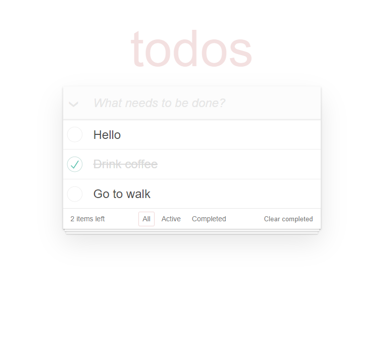

# TODO APP

## Description

A responsive Todo application built with React, featuring integration with an external API for managing tasks. Users can add, edit, delete, and filter tasks, with changes synchronized to the server. The app supports real-time updates and smooth user interactions, providing a clean and intuitive interface.

## Technologies that have been used

- HTML5
- CSS3
- SASS
- BULMA
- JAVASCRIPT (ES6+)
- TYPESCRIPT
- REACT
- REST API
- GIT

## Instructions for working with the project

1. Cloning a repository. You need to write `git clone https://github.com/boikoua/todo-app` in terminal.

2. Go to the project folder `cd todo-app`.

3. Check the node version. The version of node should be `v20.x.x`. To do this, type the command `node -v` in the terminal.

4. Install dependencies. To do this, enter the `npm install` command.

5. Run the project. To do this, enter the `npm start` command.
   After that the project will be available to you at `http://localhost:3000`.

## View project

> Link to the project
> [DEMO LINK](https://boikoua.github.io/todo-app/).

## Preview

